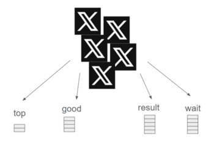

### Hi there 👋

- 🔭 I’m currently experimenting with different machine-learning methods on public data 
- 👯 I’m looking to speak with other folks with a background in economics + data science
- 📫 Reach me at visheshika.baheti@gmail.com
- 🌱 I write what I learn here: https://medium.com/@visheshikab

- ---------------------------------------------------------------------------------------
Project 1: Indian Parliament Debates since 1952 - I scrape more than 5,000 documents of parliament debate minutes to see the evolution in India's governance discourse using Topic Modelling, a Natural Language Processing technique. You can check the application here: https://indianparliamentdebates.streamlit.app/

A sneak peak:

Libraries used: pandas, BeautifulSoup, fitz, nltk, numpy, matplotlib, gensim, wordcloud 

Project 2: Twitter(X) Sentiment Analysis - I analyze tweets as positive or negative based using the Bernoulli Naive Bayes Classification technique. 

The algorithm for sentiment analysis of tweets classifies each tweet as either 'positive' or 'negative' by calculating the conditional probability of each word appearing in either sentiment category.

